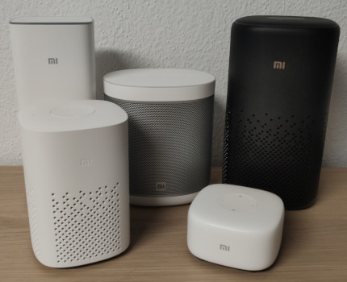

------------

# Introduction

This repo contains custom scripts and patches, to make a custom rootfs image free of propietary software, and installing open source programs.  
Patches and scripts can be tweaked, so if really want, you can keep the original functions of the Chinese XiaoAi assistant, and install new programs as well.

The main purpose of this toolset is to have your DIY Voice Assistant (Alexa-like) and Smart Speaker, with lots of integrations for music and automation.

By using [MPD], [Snapcast], [Shairport-Sync], [Upmpdcli] you can make your speaker a full media player compatible with multiple cast protocols,
and also have a voice assistant powered by [Porcupine] and [Vosk] that can interact with your [Home Assistant].  
Everything powered by Open Source Software!

[MPD]: https://www.musicpd.org/
[Snapcast]: https://github.com/badaix/snapcast
[Shairport-Sync]: https://github.com/mikebrady/shairport-sync
[Upmpdcli]: https://www.lesbonscomptes.com/upmpdcli/
[Porcupine]: https://github.com/Picovoice/porcupine
[Vosk]: https://alphacephei.com/vosk/
[Home Assistant]: https://www.home-assistant.io/

# :warning: Warning

Looks like some new speakers or firmware upgrades change the rootfs partition and include a DER certificate to verify the system.
This **may block** any changes on non-signed squashfs. **Recommended to NOT flash**, you may have an invalid rootfs and potentially lock yourself!
You can check this by running `binwalk` if it contains a Certificate entry:

```
DECIMAL       HEXADECIMAL     DESCRIPTION
--------------------------------------------------------------------------------
0             0x0             Squashfs filesystem, little endian, version 4.0, compression:xz, size: 32240378 bytes,
                              2430 inodes, blocksize: 262144 bytes, created: 2021-04-28 06:34:34
32243716      0x1EC0004       Certificate in DER format (x509 v3), header length: 4, sequence length: 830
```

# Compatibility

| Model | Name |
|-------|------|
| ![LX06 - supported][LX06] | Xiaoai Speaker Pro |
| ![LX01 - supported][LX01] | Xiaomi Mi AI Speaker Mini |
| ![L09A - supported][L09A] | Xiaoai Speaker Art (China) |
| ![L09G - not supported][L09G] | Xiaomi Mi Smart Speaker (Global, Google Assistant) |
| ![LX05 - encrypted, supported][LX05] | Xiaoai Speaker Play |
| ![L15A - encrypted, not fully supported][L15A] | Xiaomi Mi AI Speaker 2 Gen |
| ![L07A - not tested][L07A] | Redmi XiaoAI Speaker Play |
| ![MDZ-25-DT - not tested][MDZ-25-DT] | Xiaomi Mi AI Speaker 1 Gen (?) - S12 |

[LX06]: https://img.shields.io/badge/LX06-green?style=for-the-badge
[LX01]: https://img.shields.io/badge/LX01-green?style=for-the-badge
[L09A]: https://img.shields.io/badge/L09A-green?style=for-the-badge
[L09G]: https://img.shields.io/badge/L09G-red?style=for-the-badge
[LX05]: https://img.shields.io/badge/LX05-yellowgreen?style=for-the-badge
[L15A]: https://img.shields.io/badge/L15A-yellow?style=for-the-badge
[L07A]: https://img.shields.io/badge/L07A-lightgrey?style=for-the-badge
[MDZ-25-DT]: https://img.shields.io/badge/MDZ--25--DT-lightgrey?style=for-the-badge

# Requirements

You need a computer with Linux and:

- `squashfs-tools`, provides `unsquashfs` and `mksquashfs`
- `mtd-utils` (Only for model S12), provides utils for UBI images
- `make`
- Docker
- rsync
- perl (shasum)
- patience. :)

# Usage

Get a copy of your `rootfs` filesystem from your speaker. It can also be from a system upgrade file.
It should be something similar as this:

```bash
nc -vlp 8888 > $HOME/backup-image
# -----
dd if=/dev/mtd4 of=/tmp/image
nc $IP_ADDR 8888 < /tmp/image
```

Since the speakers filesystem is read-only format, we have to reflash it to add the new applications and patches.
There are three steps to perform this: **extract, patch, build**.

Optionally but recommended, prepare the packages you want to install by editing the [packages.sh] script.

[packages.sh]: https://github.com/duhow/xiaoai-patch/blob/master/packages.sh#L657

Build the docker image and run it to build all the packages. Probably it will take more than an hour.  
**NOTE:** Run the **build packages.sh** process with Docker, since the package build performs some patching to the system, otherwise it could harm your GNU/Linux installation.

```bash
docker build -t xiaoai-patch - < Dockerfile-packages
docker run -it -v $PWD:/xiaoai xiaoai-patch
```

You can now run the commands to prepare the new image.

```bash
sudo make clean
sudo make extract FILE=image-mtd4
sudo make patch MODEL=lx06
sudo make build MODEL=lx06

# or all at once :)
sudo make clean all FILE=image-mtd4 MODEL=lx06
```

**NOTE:** Ensure the image format is correct, by comparing the original and new images. Use `file` or other commands to check info.

After you have the new image ready, send it to the speaker, and **flash the not-in-use** `rootfs` partition, boot it and test.

# :warning: Unbricking

You should have some wires soldered to the board to perform TTL in case it is required.  
As long as you perform steps as described and not flashing content in wrong partitions, you can reverse failed boot with Uboot safely.

In order to enable Uboot menu, check in the environment partition that you have the setting `bootdelay=3`.  
If is set to `bootdelay=0` then Uboot will continue normal boot process and you won't be able to stop it unless you get into fastboot or recovery mode. (?)  
In most cases, binary program is `fw_setenv` or `fw_env` and data is set into first partition as string.

Ensure you can access Uboot before writing changes, it is your rescue!

```
Hit any key to stop autoboot:  0
```

# DISCLAIMER
YOU are responsible for any use or damage this software may cause. This repo and its content is intended for educational purposes only. Use at your own risk.
