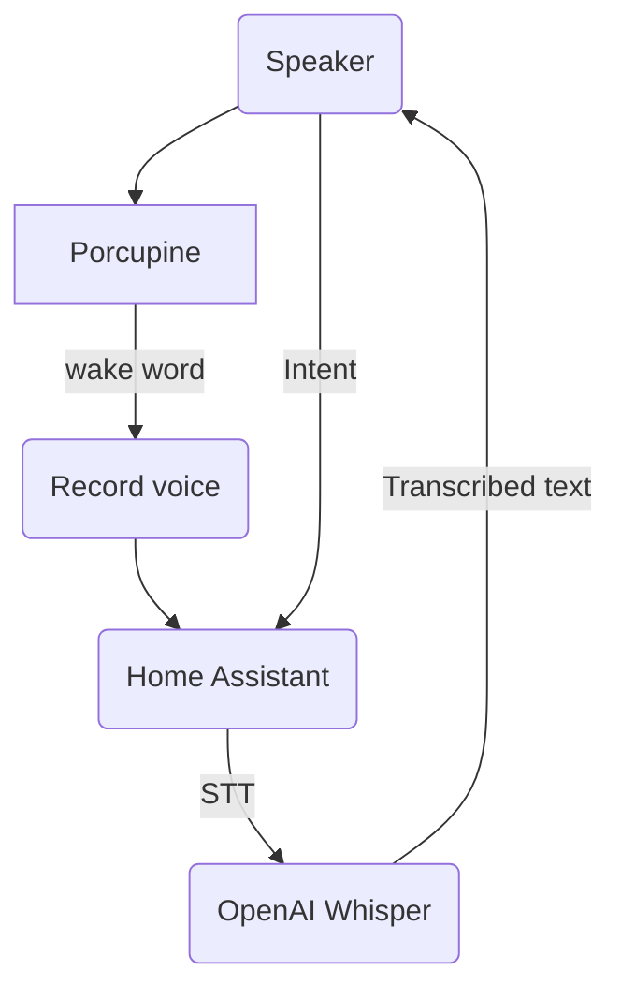

# Voice Assistant

In order to have the experience of Voice Assistant, the following approach is done:



## Setup

Create and configure the following files in the speaker:

`/data/listener`
```bash
HA_URL="https://hass.example.net"
HA_TOKEN="ey...."
# change if using any other, for example "cloud".
HA_STT_PROVIDER=stt.faster_whisper
STT_RATE=16000

# use any of Porcupine available
# https://github.com/Picovoice/porcupine/tree/v1.9/resources/keyword_files/raspberry-pi
WORD=alexa
# NOTE: "cloud" provider uses two-letter language, for example "en-US", "es-ES"...
STT_LANGUAGE=en
```

`/data/tts.conf`
```bash
LANGUAGE=en
```

You will hear back the transcribed message with TTS.

## Troubleshooting

If you always receive `error` messages, check that `date` is correct, as it can cause TLS connection issues.
You can sync time manually:

```bash
ntpd -q -p pool.ntp.org
```

Find any transcribed content at `/tmp/stt.log` , along with `/tmp/stt.json` status.

If you want to change the language for Speech-to-Text:

- Change `STT_LANGUAGE` config in the speaker
- Run `/etc/init.d/listener restart` or mute and un-mute the speaker
- Change the language in Home Assistant STT Whisper Addon
- Restart Home Assistant to refresh the new STT entity settings
